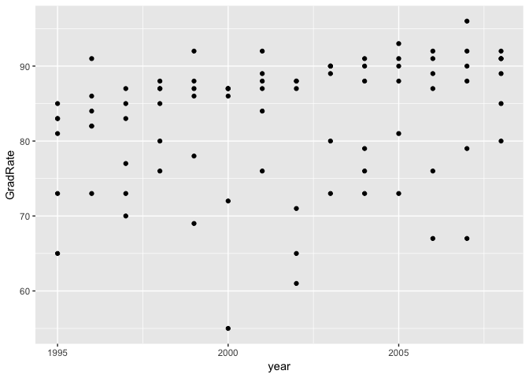
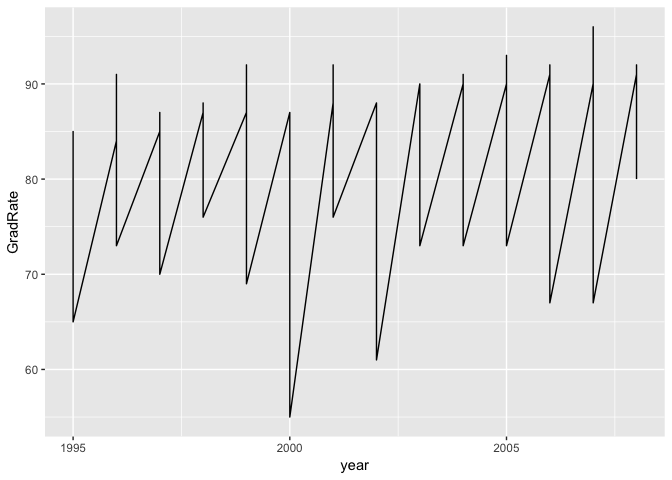
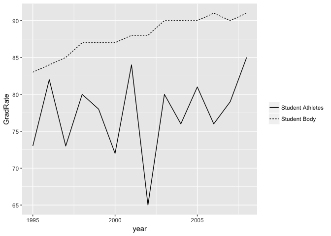
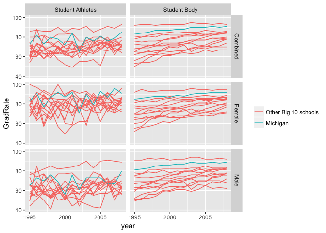

# Lab 1, September 12

- [Introductory Poll](#introductory-poll)
- [Installing R and RStudio](#installing-r-and-rstudio)
- [R Preliminaries](#r-preliminaries)
- [Importing data](#importing-data)
- [Examining a data frame](#examining-a-data-frame)
- [Lab exercise](#lab-exercise)

## Introductory Poll
If you haven't already, please take <a href="https://umich.instructure.com/courses/181629/quizzes/52791" target="_blank">this Canvas survey</a>

## Installing R and RStudio

The classroom machines (and the machines in any campus computer lab) should have RStudio set up and ready to use.  
To use your own laptop:  
1. First <a href="https://cloud.r-project.org/" target="_blank">install R</a>
2. Then <a href="https://www.rstudio.com/products/rstudio/download/#download" target="_blank">install RStudio</a>
3. Open RStudio
4. Install the tidyverse package:
   ```R
   install.packages("tidyverse")
   ```
5. Load the tidyverse package:
   ```R
   library(tidyverse)
   ```
Each time you open RStudio, you will need to load the tidyverse package (step 5). The other setup steps only need to be performed once.


## R Preliminaries

### Scripts, working directory, workspace

A script is a file with a list of R commands. It will be helpful to create and save a script file for each lab or homework assignment. 
- In RStudio, select File &gt; New File &gt; R Script. 
- Type the command `library(tidyverse)` into the first line. 
- Save the script with the name lab1.R in a convenient folder on your computer. 
- Add further commands to the file and save your work periodically.

Your R session takes place in a *working directory*, which is a folder on your computer. If you are loading data into R using a file, R will look for that file in the working directory.

``` r
getwd() # Print the current working directory
setwd('~/Documents/your_directory/') # Set the working directory
list.files() # List the files in your working directory
```

Your R *workspace* contains all of the objects you have created in your R session. Each time you assign a value to a variable name you have created an object.

``` r
x <- 3
ls() # List all of the objects in your workspace
```

    ## [1] "x"

``` r
print(y)
```

    ## Error in print(y): object 'y' not found

### R documentation

Use `?function_name` to see the help page for any function. The online ggplot documentation is available <a href="http://ggplot2.tidyverse.org/reference/index.html" target="_blank">here</a>.

### R Vocabulary

-   Data frame: an R object roughly similar to an Excel spreadsheet. Each row is an observation and each column contains a single variable.
-   Factor: This is what R calls a categorical variable. *Levels* are the unique possible values of a factor.

## Importing data

On our <a href="https://umich.instructure.com/courses/181629/files" target="_blank">Canvas site</a>, download `big10_gradrates.txt`. This file contains six-year graduation rates for universities in the Big 10 (<a href="https://www.icpsr.umich.edu/icpsrweb/content/NCAA/data.html" target="_blank">source</a>). Save this file in your working directory.

Now load the file into your workspace. The function `read.table` imports data from a text file.
Look at the help page for `read.table`. Import the `big10_gradrates.txt` file, using the following information to help you specify the arguments to `read.table`:
- The file name in your working directory should be `big10_gradrates.txt` 
- The first row of the file contains variable names 
- The fields (variable values) in the file are separated with commas

The results of `read.table` are returned as a data frame object. Use the assignment operator `<-` to name your data frame `grad`.  

Let's see what variables are in this data set:

``` r
names(grad)
```

    ## [1] "SCL_NAME"    "SCL_PRIVATE" "year"        "Gender"      "Population" 
    ## [6] "GradRate"

The `Population` variable indicates whether the graduation rate (`GradRate`) is computed for student-athletes or all students. The `Gender` variable indicates whether the graduation rate is computed for both men and women, only men, or only women.

## Examining a data frame

Here are some functions that help us understand the structure of a data set:
- `str(grad)` will display a data frame's variable names, number of observations, and other information. 
- `head(grad)` displays the first few rows of the data frame
- `grad$year`: the dollar sign returns all of the values for a single variable in a data frame. 
- `levels(grad$SCL_NAME)`: print the unique values of a factor (categorical) variable 
- `unique(grad$year)`: print the unique values of a variable 
- `View(grad)` look at the data frame in a new window, displayed like an Excel spreadsheet. 
- `table(grad$Population)` count the number of observations for each level of a factor.

Let's take a look at the graduation rate data set.

```r
head(grad)
```

|SCL_NAME |SCL_PRIVATE | year|Gender   |Population   | GradRate|
|:------------------------------------------|:-----------|----:|:--------|:------------|--------:|
|University of Illinois at Urbana-Champaign |(0) Public  | 1995|Combined |Student Body |       78|
|Northwestern University                    |(1) Private | 1995|Combined |Student Body |       92|
|Indiana University-Bloomington             |(0) Public  | 1995|Combined |Student Body |       68|
|University of Iowa                         |(0) Public  | 1995|Combined |Student Body |       65|
|University of Maryland-College Park        |(0) Public  | 1995|Combined |Student Body |       65|
|University of Michigan-Ann Arbor           |(0) Public  | 1995|Combined |Student Body |       83|


``` r
levels(grad$Gender)
```

    ## [1] "Combined" "Female"   "Male"

``` r
levels(grad$Population)
```

    ## [1] "Student Athletes" "Student Body"

## Lab exercise

Let's start by plotting the graduation rate for the University of Michigan.
Filter the data set to only include graduation rates for Michigan (we will learn more about filtering later in the course):

``` r
grad_mich <- filter(grad, SCL_NAME == "University of Michigan-Ann Arbor")
ggplot(grad_mich) + geom_point(aes(x=year, y=GradRate))
```

{: .center-image }

This doesn't look so great. Maybe a line would be better.

``` r
ggplot(grad_mich) + geom_line(aes(x=year, y=GradRate))
```

{: .center-image }

Yikes. Remember the data set has graduation rates for student athletes, all students, men, and women. The `table` function can be helpful here:

``` r
# The number of observations in each 
# combination of these categorical variables
table(grad_mich$Population, grad_mich$Gender) 
```

    ##                   
    ##                    Combined Female Male
    ##   Student Athletes       14     14   14
    ##   Student Body           14     14   14

There are 14 years in this data set. To correctly plot the graduation rates over time we should have one line per group of 14 observations.  
Let's ignore the gender variable right now and plot one line for athletes and one line for the whole student body. 

``` r
grad_mich <- filter(grad_mich, Gender=="Combined")
ggplot(grad_mich) +
  geom_line(aes(x=year, y=GradRate, linetype=Population)) +
  scale_linetype_discrete(name="")
```

{: .center-image }
Examine the help page for `scale_linetype_discrete`. Adding a discrete scale like this lets you control the legend title, labels, etc.

### Assignment (in class)

Your task is to recreate this figure:  
{: .center-image }

Hints:
- Use the original `grad` data set, not `grad_mich`. 
- Add `scale_color_hue` to your plot, specifying the `breaks`, `name`, and `labels` arguments.
- You will need to map the `group` aesthetic to the appropriate variable.

### ggplot extras

- Edit the x-axis label: `+ xlab("my label")`
- Add a title: `+ ggtitle("A title")`
- You can control most of the visual elements of a plot using <a href="http://ggplot2.tidyverse.org/reference/theme.html" target="_blank">theme</a>.