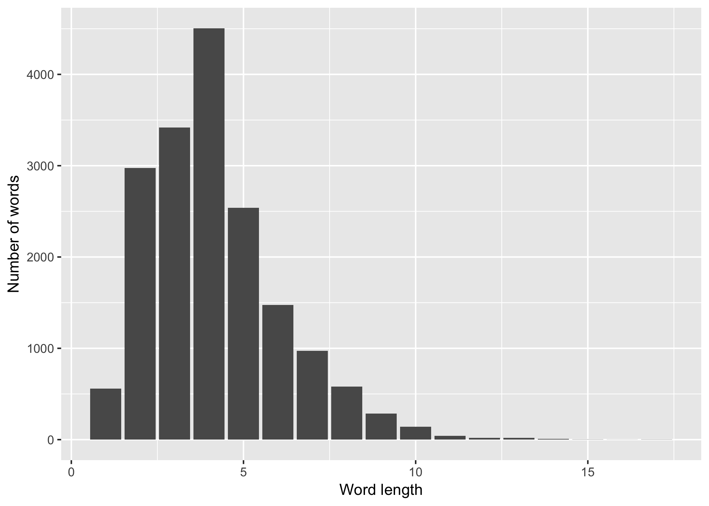

# Lab 10, November 21

[Solutions](lab10sol)

-   [A few more `stringr` functions](#a-few-more-stringr-functions)
    -   [`str_replace`](#str_replace)
    -   [`str_c`](#str_c)
    -   [`str_split`](#str_split)
-   [Regular expression backreferences](#regular-expression-backreferences)
-   [Exercises](#exercises)

This lab describes a few more functions from the `stringr` package and contains additional exercises using Shakespeare's sonnets. You should complete [Lab 9](../lab9/#exercises){:target="_blank"} before attempting the exercises in this lab.

``` r
library(stringr)
library(tidyverse)
```

## A few more `stringr` functions

### `str_replace`

[`str_replace`](http://stringr.tidyverse.org/reference/str_replace.html){:target="_blank"} matches a regular expression and replaces the match with another string.

``` r
x <- "The quick brown fox jumps over the lazy dog."
# replace the first two consecutive vowels with ??
str_replace(x, "[aeiou]{2}", "??")
```

    ## [1] "The q??ck brown fox jumps over the lazy dog."

``` r
# replace all spaces or periods with two dashes
str_replace_all(x, "[ .]", "--")
```

    ## [1] "The--quick--brown--fox--jumps--over--the--lazy--dog--"

### `str_c`

[`str_c`](http://stringr.tidyverse.org/reference/str_c.html){:target="_blank"} combines multiple strings into a single string. The result will have the same number of elements as the longest input string.

``` r
y1 <- c("The", "quick", "fox", "jumps")
y2 <- c("over", "the", "lazy", "dog.")
str_c(y1, y2, sep=" ")
```

    ## [1] "The over"   "quick the"  "fox lazy"   "jumps dog."

Specifying the `collapse` argument will reduce the result to a single string (a character vector of length 1).
``` r
# collapse the elements of y1 into a single string
# each element is separated by a space in the result
str_c(y1, collapse=" ") 
```

    ## [1] "The quick fox jumps"

### `str_split`

[`str_split`](http://stringr.tidyverse.org/reference/str_split.html){:target="_blank"} splits a vector of strings into pieces delimited by a given regular expression match.

``` r
x
```

    ## [1] "The quick brown fox jumps over the lazy dog."


``` r
str_split(x, "t", simplify=TRUE)
```

    ##      [,1]                              [,2]          
    ## [1,] "The quick brown fox jumps over " "he lazy dog."

``` r
str_split(x, "\\s", simplify=TRUE)
```

    ##      [,1]  [,2]    [,3]    [,4]  [,5]    [,6]   [,7]  [,8]   [,9]  
    ## [1,] "The" "quick" "brown" "fox" "jumps" "over" "the" "lazy" "dog."

## Regular expression backreferences

Wrapping parts of regular expressions in parentheses allow you to refer to those parts using backreferences.

This expression matches arbitrary-length substrings that begin and end with the same character:

``` r
states <- c("New Hampshire", "Connecticut", "Massachusetts", "Vermont", "Maine", "Rhode Island")
str_extract(states, "(.).*\\1")
```

    ## [1] "ew Hampshire" "nn"           "assa"         NA            
    ## [5] NA             "de Island"

Backreferences can be used in `str_replace`:

``` r
# Reverse the order of the first four letters
str_replace(states, "^(.)(.)(.)(.)", "\\4\\3\\2\\1")
```

    ## [1] " weNHampshire" "nnoCecticut"   "ssaMachusetts" "mreVont"      
    ## [5] "niaMe"         "dohRe Island"

## Exercises

We will continue manipulating the text of Shakespeare's sonnets from [Lab 9](../lab9/#exercises){:target="_bank"}. To get started, run this code, which incorporates answers to exercises 1, 2, and 3 from Lab 9.

``` r
# Required setup from Lab 9
sk <- read_lines('shakespeare_sonnets.txt')
sk <- sk[str_length(sk)>0]      # Remove zero-length lines
sk <- str_trim(sk, side='left') # Remove leading whitespace
sk <-                           # Remove lines containing only a roman numeral
  sk[!str_detect(sk, "^[ICDMLVX]+$")]
```

1.  Find lines containing three-letter strings that are repeated. For example, "contented" repeats the three-letter string `nte` twice in a row.

2.  Using [`str_replace_all`](http://stringr.tidyverse.org/reference/str_replace.html){:target="_blank"}, remove all `!`, `,`, `'`, `;`, `:`, `?` and `.` characters from `sk`. Store the result in an object called `sk2`.

3.  Replace all `--` (two hyphens) in `sk2` with a single space.

4.  Now combine the elements of `sk2` into a single string, called `sk2_combined`, using [`str_c`](http://stringr.tidyverse.org/reference/str_c.html){:target="_blank"}. Include the argument `collapse=" "` so that the result is a single string containing all of the words in Shakespeare's sonnets, separated by spaces.  

    To check your answer, run this command:

    ``` r
    str_sub(sk2_combined, 1, 300)
    ```

        ## [1] "From fairest creatures we desire increase That thereby beautys rose might never die But as the riper should by time decease His tender heir might bear his memory But thou contracted to thine own bright eyes Feedst thy lights flame with self-substantial fuel Making a famine where abundance lies Thy s"

1.  Use [`str_split`](http://stringr.tidyverse.org/reference/str_split.html){:target="_blank"} to split `sk2_combined` into individual words. The splitting pattern should match one or more whitespace characters (`\s`). Include the argument `simplify=TRUE`.

1.  Count the number of letters in each word using [`str_length`](http://stringr.tidyverse.org/reference/str_length.html){:target="_blank"}. Create the following chart, which displays the frequency of word lengths in Shakespeare's sonnets. 
    
