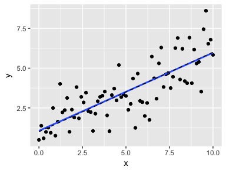
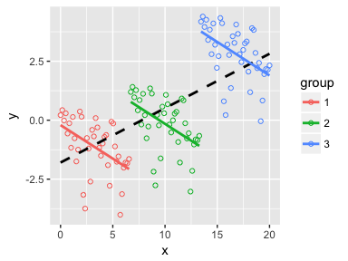

# Lab 11, November 28

-   [Grouped matches](#grouped-matches)
-   [Functions](#functions)
    -   [Exercise](#exercise)

``` r
library(tidyverse)
library(stringr)
```

### Grouped matches

As you saw in [Lab 10](http://www.brookluers.com/teaching/stats306f17/lab10/#regular-expression-backreferences){:target="_blank"}, grouping a regular expression with parentheses allows us to reference those groups later in the expression, or when replacing parts of a string with `str_replace`. We can also extract each part of a grouped expression using `str_match` or `tidyr::extract`. See [section 14.4](http://r4ds.had.co.nz/strings.html#grouped-matches) in the textbook.

`str_match` produces a matrix with one column for the entire matched substring and one column for each group:

``` r
petnames <- c("dog: Fido", "cat: Clarence", "cat: Milo", "guinea pig: Alan", "ferret: Dennis")
str_match(petnames, "([a-zA-Z ]+): ([A-Za-z]+)")
```

    ##      [,1]               [,2]         [,3]      
    ## [1,] "dog: Fido"        "dog"        "Fido"    
    ## [2,] "cat: Clarence"    "cat"        "Clarence"
    ## [3,] "cat: Milo"        "cat"        "Milo"    
    ## [4,] "guinea pig: Alan" "guinea pig" "Alan"    
    ## [5,] "ferret: Dennis"   "ferret"     "Dennis"

`extract` from the `tidyr` package is useful when we have text data inside a data frame.

``` r
(petdf <- tibble(petnames))
```

    ## # A tibble: 5 x 1
    ##           petnames
    ##              <chr>
    ## 1        dog: Fido
    ## 2    cat: Clarence
    ## 3        cat: Milo
    ## 4 guinea pig: Alan
    ## 5   ferret: Dennis

``` r
tidyr::extract(petdf,                # a data frame
               petnames,             # the character-type column of interest
               c("type","name"),     # names of new columns, one per group
               "([a-zA-Z ]+): ([A-Za-z]+)",  # grouped regular expression 
               remove=FALSE)         # should the source column be removed?
```

    ## # A tibble: 5 x 3
    ##           petnames       type     name
    ## *            <chr>      <chr>    <chr>
    ## 1        dog: Fido        dog     Fido
    ## 2    cat: Clarence        cat Clarence
    ## 3        cat: Milo        cat     Milo
    ## 4 guinea pig: Alan guinea pig     Alan
    ## 5   ferret: Dennis     ferret   Dennis

### Functions

The textbook ([chapter 19](http://r4ds.had.co.nz/functions.html#functions){:target="_blank"}) has a good introduction to functions. Here I will provide an example to illustrate the general process of writing a function.

Suppose you want to simulate data from a simple linear regression model,
$$ y_i = \beta_0 + \beta_1 x + \epsilon_i$$

``` r
x <- seq(0, 10, length.out=75)
beta1 <- 0.5
beta0 <- 1
sigma <- 1.2
truemean <- beta0 + beta1 * x
y <- truemean + rnorm(n=length(x), mean=0, sd=sigma)
ggplot(tibble(x,y,truemean)) + geom_point(aes(x=x,y=y)) + 
  geom_smooth(aes(x=x,y=y), method='lm', se=F) +
  geom_line(aes(x=x,y=truemean),linetype='dashed')
```



To generate data from many different regression models, we should write a function. We can start by coyping the code we used previously into the body of a new function:

``` r
regSim <- function() {  # Need to fill in the function arguments
  x <- seq(0, 10, length.out=75)
  beta1 <- 0.5
  beta0 <- 1
  sigma <- 1.2
  truemean <- beta0 + beta1 * x
  y <- truemean + rnorm(n=length(x), mean=0, sd=sigma)
}
```

What are the parameters or inputs to this simulation? We can change the regression parameters \\(\beta_0, \beta_1\\) and \\(\sigma\\) and the values of the independent variable \\(x\\). These should be arguments to our function.

``` r
regSim <- function(x, beta0, beta1, sigma) {
  truemean <- beta0 + beta1 * x
  y <- truemean + rnorm(n=length(x), mean=0, sd=sigma)
}
```

It would be convenient if this function returned a `data.frame` so we can easily create graphs of the simulated data. We could also provide default values for some of the arguments and check for improper values.

``` r
regSim <- function(x, beta0, beta1, sigma = 1, seed=99) {
  set.seed(seed)
  if (sigma <= 0)
    stop("Standard deviation must be positive")
  truemean <- beta0 + beta1 * x
  y <- truemean + rnorm(n=length(x), mean=0, sd=sigma)
  return(tibble(x, truemean, y))
}
```

We can use this function to illustrate [Simpson's Paradox](https://en.wikipedia.org/wiki/Simpson%27s_paradox){:target="_blank"}.

``` r
x <- seq(0, 20, length.out=120)
d1 <- regSim(x[1:40], 0, -0.3)
d2 <- regSim(x[41:80], 3, -0.3)
d3 <- regSim(x[81:120], 8, -0.3)
ggplot(bind_rows(d1, d2, d3, .id='group')) +
  geom_point(aes(x=x,y=y,color=group),shape=1) + 
  stat_smooth(aes(x=x,y=y), method='lm',se=F, color = 'black',
              linetype='dashed') + 
  stat_smooth(aes(x=x,y=y,color=group), method='lm',se=F)
```



### Exercise

The car-cyclist crash data set contains the approximate time when each crash occurred.

``` r
cr <- read_csv('cyclist_crashes.txt')
head(cr$Time.of.Day)
```

    ## [1] "7:00 PM - 8:00 PM"   "10:00 AM - 11:00 AM" "3:00 PM - 4:00 PM"  
    ## [4] "8:00 PM - 9:00 PM"   "4:00 PM - 5:00 PM"   "4:00 AM - 5:00 AM"

In this exercise we will extract the numeric hour from `Time.of.Day` and convert it to 24-hour time.

1.  Write a function called `time24` that takes two arguments: `h12`, a vector of integers, and `pm` a logical vector. The function should convert the integers in `h12` from 12-hour time to 24-hour time. The vector `pm` indicates whether the corresponding element of `h12` is an hour that occurrs before 12 noon.  

    Here is an example of the expected output:  

    ``` r
    times <- c(rep(1:12, 2), NA)
    pm <- c(rep(c(TRUE,FALSE), each=12), NA)
    time24(times, pm)
    ```

        ##  [1] 13 14 15 16 17 18 19 20 21 22 23 12  1  2  3  4  5  6  7  8  9 10 11
        ## [24]  0 NA

    Optionally, you can check that the arguments are valid:

    ``` r
    time24(c(11, 10), c(FALSE, TRUE, TRUE, TRUE))
    ```

        ## Error in time24(c(11, 10), c(FALSE, TRUE, TRUE, TRUE)): unequal length vectors

1.  What are the unique values of `cr$Time.of.Day`? Replace ocurrences of `midnight` with `AM` and replace `noon` with `PM`.

2.  Use `tidyr::extract` to create two new columns: `tstart` and `tend`, containing the beginning and ending hour for the one-hour time window represented by `Time.of.Day`. Your regular expression should match the hour and the PM/AM indicator (e.g. `8:00 AM`). Include the argument `remove=FALSE`.  

    Use the following code to check your result:  

    ``` r
    cr %>% select(Time.of.Day, tstart,tend) %>%
      count(tstart, tend)
    ```

        ## # A tibble: 25 x 3
        ##      tstart     tend     n
        ##       <chr>    <chr> <int>
        ##  1  1:00 AM  2:00 AM   106
        ##  2  1:00 PM  2:00 PM  1473
        ##  3 10:00 AM 11:00 AM   821
        ##  4 10:00 PM 11:00 PM   600
        ##  5 11:00 AM 12:00 PM  1140
        ##  6 11:00 PM 12:00 AM   323
        ##  7 12:00 AM  1:00 AM   203
        ##  8 12:00 PM  1:00 PM  1451
        ##  9  2:00 AM  3:00 AM    91
        ## 10  2:00 PM  3:00 PM  1784
        ## # ... with 15 more rows

1.  Create another two columns, `hnum` and `ampm`, containing, respectively, the numeric hour corresponding to `tstart` and the string `AM` or `PM` as appropriate. Provide the arguments `remove=FALSE` and `convert=TRUE`.  

    Check your answer with this command:  

    ``` r
    cr %>% select(tstart, tend, hnum, ampm)
    ```

        ## # A tibble: 23,809 x 4
        ##      tstart     tend  hnum  ampm
        ##  *    <chr>    <chr> <int> <chr>
        ##  1  7:00 PM  8:00 PM     7    PM
        ##  2 10:00 AM 11:00 AM    10    AM
        ##  3  3:00 PM  4:00 PM     3    PM
        ##  4  8:00 PM  9:00 PM     8    PM
        ##  5  4:00 PM  5:00 PM     4    PM
        ##  6  4:00 AM  5:00 AM     4    AM
        ##  7 11:00 AM 12:00 PM    11    AM
        ##  8 10:00 AM 11:00 AM    10    AM
        ##  9  8:00 PM  9:00 PM     8    PM
        ## 10  3:00 PM  4:00 PM     3    PM
        ## # ... with 23,799 more rows

1.  Use `mutate` to add a column called `hnum24` which contains the 24-hour time corresponding to `tstart`. (Apply your function `time24`.)  

    Check your answer:  

    ``` r
    cr %>% select(tstart, hnum, ampm, hnum24)
    ```

        ## # A tibble: 23,809 x 4
        ##      tstart  hnum  ampm hnum24
        ##       <chr> <int> <chr>  <dbl>
        ##  1  7:00 PM     7    PM     19
        ##  2 10:00 AM    10    AM     10
        ##  3  3:00 PM     3    PM     15
        ##  4  8:00 PM     8    PM     20
        ##  5  4:00 PM     4    PM     16
        ##  6  4:00 AM     4    AM      4
        ##  7 11:00 AM    11    AM     11
        ##  8 10:00 AM    10    AM     10
        ##  9  8:00 PM     8    PM     20
        ## 10  3:00 PM     3    PM     15
        ## # ... with 23,799 more rows

<script type="text/javascript"
    src="http://cdn.mathjax.org/mathjax/latest/MathJax.js?config=TeX-AMS-MML_HTMLorMML">
</script>