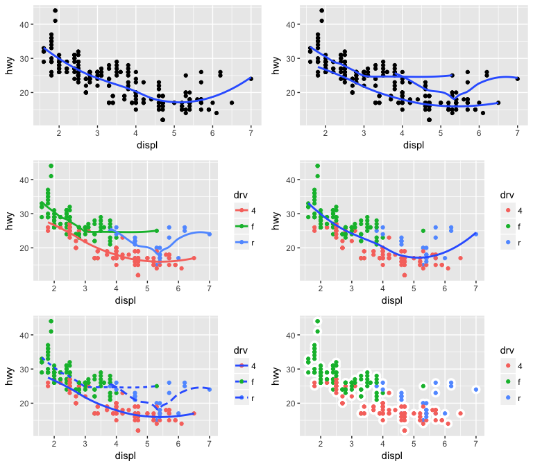
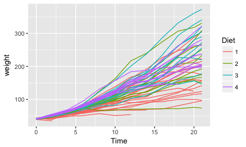
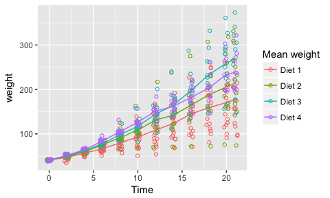

# Lab 2, September 19

-   [Exercise 1](#exercise-1)
-   [Exercise 2](#exercise-2)
    -   [Background](#background)
    -   [Assignment](#assignment)
-   [Solutions](#solutions)


## Exercise 1

To test your knowledge of ggplot geoms, complete <a href="http://r4ds.had.co.nz/data-visualisation.html#exercises-3" target="_blank">Exercise 3.6.1 Number 6</a> from the textbook. You are asked to recreate the following plots using the `mpg` data frame.



## Exercise 2

### Background

This exercise allows you to practice statistical transformations and position adjustments in ggplot. We will use the `ChickWeight` data set, which is automatically loaded when you start an R session.

Run the command `?ChickWeight` to learn about how the data were collected.

We would like to understand how the different diets affected the chicks' weight over time.

Let's start by plotting the growth trajectory of each chick over time.

``` r
ggplot(ChickWeight)+
  geom_line(aes(x=Time, y=weight, group=Chick, color=Diet))
```



It might be easier to compare the four diets by computing the average chick weight at each time point.

### Assignment

Recreate the following plot. Each line plots the mean chick weight over time for each diet. The points display the individual chick weights over time.


Hints:
-   Use [`stat_summary`](http://ggplot2.tidyverse.org/reference/stat_summary.html){:target="_blank"} to plot the mean weight for each diet over time.
-   Use [`position_jitter`](http://ggplot2.tidyverse.org/reference/position_jitter.html){:target="_blank"} to move the points slightly to the left and right. Do not adjust the vertical position of the points.
-   Add `scale_color_hue` to your plot, specifying the `name`, `breaks`, and `labels` arguments to control the legend.

## Solutions
[Solutions to exercise 1 and 2](lab2sol)