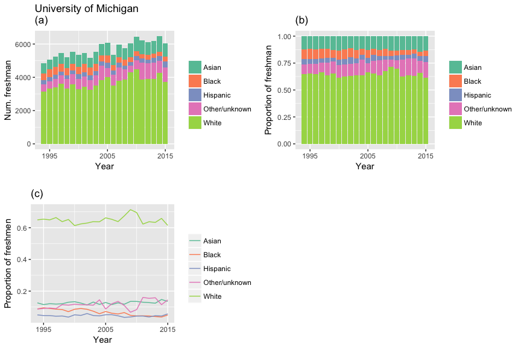
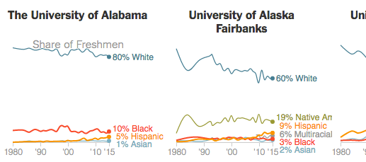
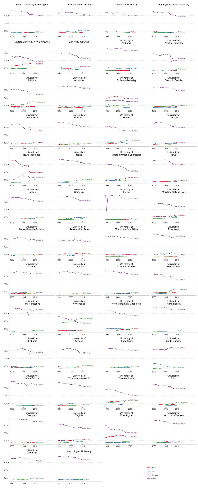

# Lab 2, September 19

-   [Exercise 1](#exercise-1)
-   [Exercise 2](#exercise-2)
    -   [Background](#background)
    -   [Assignment](#assignment)
-   [Exercise 3](#exercise-3)
    -   [Background](#background-1)
    -   [Assignment Part 1](#assignment-part-1)
    -   [Assignment Part 2](#assignment-part-2)


## Exercise 1

To test your knowledge of ggplot geoms, complete <a href="http://r4ds.had.co.nz/data-visualisation.html#exercises-3" target="_blank">Exercise 3.6.1 Number 6</a> from the textbook. You are asked to recreate the following plots using the `mpg` data frame.


## Exercise 2

### Background

This exercise allows you to practice statistical transformations and position adjustments in ggplot. We will use the `ChickWeight` data set, which is automatically loaded when you start an R session.

Run the command `?ChickWeight` to learn about how the data were collected.

We would like to understand how the different diets affected the chicks' weight over time.

Let's start by plotting the growth trajectory of each chick over time.

``` r
ggplot(ChickWeight)+
  geom_line(aes(x=Time, y=weight, group=Chick, color=Diet))
```


It might be easier to compare the four diets by computing the average chick weight at each time point.

### Assignment

Recreate the following plot. Each line plots the mean chick weight over time for each diet. The points display the individual chick weights over time.


Hints:
-   Use [`stat_summary`](http://ggplot2.tidyverse.org/reference/stat_summary.html){:target="_blank"} to plot the mean weight for each diet over time.
-   Use [`position_jitter`](http://ggplot2.tidyverse.org/reference/position_jitter.html){:target="_blank"} to move the points slightly to the left and right. Do not adjust the vertical position of the points.
-   Add `scale_color_hue` to your plot, specifying the `name`, `breaks`, and `labels` arguments to control the legend.

## Exercise 3

### Background

This exercise is inspired by a recent New York Times [visualization](https://www.nytimes.com/interactive/2017/08/24/us/affirmative-action.html?mcubz=1){:target="_blank"} of college enrollment rates by race/ethnicity. We will focus on public flagship universities.

Download `enrollment.txt` from our <a href="https://umich.instructure.com/courses/181629/files" target="_blank">Canvas site</a> and import the data set into an R data frame named `enr`.

(These data are from <a href="https://nces.ed.gov/ipeds/Home/UseTheData" target="_blank">IPEDS</a>, a survey conducted by the National Center for Education Statistics.)

Print the first few rows of `enr` in your R console. For each of the 50 public flagship universities, this data set contains the number (`count`) of new freshmen in each of five race/ethnicity categories (`reth`) for the years 1994--2015.

### Assignment Part 1

Reference material: <a href="http://r4ds.had.co.nz/data-visualisation.html#statistical-transformations" target="_blank">statistical transformations</a>

First we will focus on the University of Michigan. Filter `enr` so it only contains data for Michigan:

``` r
umenr <- filter(enr, School=="University of Michigan-Ann Arbor")
```

Now recreate the following three plots:



These graphs use a color palette developed by [Color Brewer](http://colorbrewer2.org/){:target="_blank"}:
```r 
 +  scale_fill_brewer(palette='Set2',name='')
```

Which plot you think is more informative?

### Assignment Part 2

Now recreate, as closely as possible, the NYT plot of all 50 public flagship universities, displaying the proportion of freshmen in each race/ethnicity category over time. 



Use the `pct` variable in the `enr` data frame. You can remove the "other" category for simplicity.

Here is a code snippet to get you started. Fill in the `...` with your own code.

``` r
ggplot(filter(enr, reth!="Other/unknown")) +
  ... # add the appropriate geom
  facet_wrap(...) + 
  scale_x_continuous(breaks=...,
                     limits=...) + 
  ... + # change the axis labels 
  scale_color_brewer(palette='Set1',name='')
```

My attempt is below. There are clearly some problems with the way I am calculating these percentages (e.g. University of Maine). Perhaps a future lab exercise will consist of properly downloading and computing these enrollment percentages.

