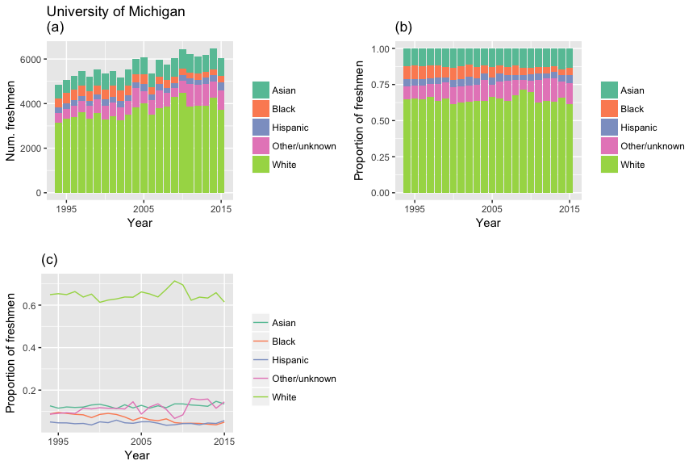
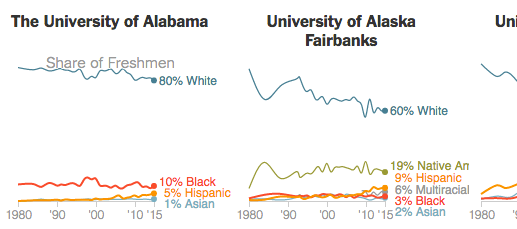
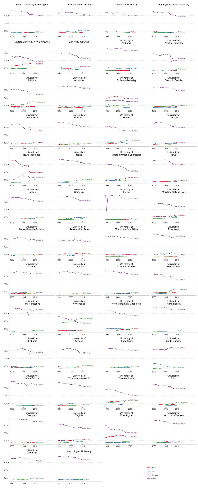
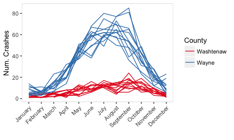

# Lab 3, September 26

-   [Exercise 1](#exercise-1)
    -   [Assignment Part 1](#assignment-part-1)
    -   [Assignment Part 2](#assignment-part-2)
-   [Exercise 2](#exercise-2)


## Exercise 1

### Background

This exercise is inspired by a recent New York Times [visualization](https://www.nytimes.com/interactive/2017/08/24/us/affirmative-action.html?mcubz=1){:target="_blank"} of college enrollment rates by race/ethnicity. We will focus on public flagship universities.

Download `enrollment.txt` from our <a href="https://umich.instructure.com/courses/181629/files" target="_blank">Canvas site</a> and import the data set into an R data frame named `enr`.

(These data are from <a href="https://nces.ed.gov/ipeds/Home/UseTheData" target="_blank">IPEDS</a>, a survey conducted by the National Center for Education Statistics.)

Print the first few rows of `enr` in your R console. For each of the 50 public flagship universities, this data set contains the number (`count`) of new freshmen in each of five race/ethnicity categories (`reth`) for the years 1994--2015.

### Assignment Part 1

Reference material: <a href="http://r4ds.had.co.nz/data-visualisation.html#statistical-transformations" target="_blank">statistical transformations</a>

First we will focus on the University of Michigan. Filter `enr` so it only contains data for Michigan:

``` r
umenr <- filter(enr, School=="University of Michigan-Ann Arbor")
```

Now recreate the following three plots:



These graphs use a color palette developed by [Color Brewer](http://colorbrewer2.org/){:target="_blank"}:
```r 
 +  scale_fill_brewer(palette='Set2',name='')
```

Which plot you think is more informative?

### Assignment Part 2

Now recreate, as closely as possible, the NYT plot of all 50 public flagship universities, displaying the proportion of freshmen in each race/ethnicity category over time. 



Use the `pct` variable in the `enr` data frame. You can remove the "other" category for simplicity.

Here is a code snippet to get you started. Fill in the `...` with your own code.

``` r
ggplot(filter(enr, reth!="Other/unknown")) +
  ... # add the appropriate geom
  facet_wrap(...) + 
  scale_x_continuous(breaks=...,
                     limits=...) + 
  ... + # change the axis labels 
  scale_color_brewer(palette='Set1',name='')
```

My attempt is below. There are clearly some problems with the way I am calculating these percentages (e.g. University of Maine). Perhaps a future lab exercise will consist of properly downloading and computing these enrollment percentages.



## Exercise 2

In this exercise we will start practicing some of the data transformations described in [Chapter 5](http://r4ds.had.co.nz/transform.html){:target="_blank"}.

We will use data on cyclist-involved crashes in Michigan (from [MTCF](https://www.michigantrafficcrashfacts.org/){:target="_blank"}). Download `cyclist_crashes.txt` from our Canvas site. Load the data into a data frame called `cr`. Each row in this data frame represents a single car-cyclist crash in Michigan. Familiarize yourself with the variables in this data set.

1.  Use `select` to make `cr` contain the following variables with the following names:

    |         id|date       | year|month     |day      |tod                 |County    |city                             |worst.injury                 |
    |----------:|:----------|----:|:---------|:--------|:-------------------|:---------|:--------------------------------|:----------------------------|
    | 2004374322|2004-09-23 | 2004|September |Thursday |7:00 PM - 8:00 PM   |Macomb    |Macomb County: Roseville         |Fatal                        |
    | 2004374216|2004-11-07 | 2004|November  |Sunday   |10:00 AM - 11:00 AM |Monroe    |Monroe County: Lasalle Twp.      |Fatal                        |
    | 2004373946|2004-10-19 | 2004|October   |Tuesday  |3:00 PM - 4:00 PM   |Berrien   |Berrien County: Lincoln Twp.     |B - nonincapacitating injury |
    | 2004373597|2004-11-22 | 2004|November  |Monday   |8:00 PM - 9:00 PM   |Oakland   |Oakland County: Hazel Park       |A - incapacitating injury    |
    | 2004371832|2004-12-16 | 2004|December  |Thursday |4:00 PM - 5:00 PM   |Hillsdale |Hillsdale County: Hillsdale Twp. |B - nonincapacitating injury |
    | 2004371712|2004-12-28 | 2004|December  |Tuesday  |4:00 AM - 5:00 AM   |Kent      |Kent County: Wyoming             |A - incapacitating injury    |
        
    Note: Give the name `id` to the variable `Crash.Instance`.

2.  How many cyclist-involved crashes were there in Washtenaw County in 2004? How many were there in Washtenaw County in August of 2015? Use `filter` and `nrow`.

3.  Use `group_by` and `summarize` to compute the number of cyclist-involved crashes in each county in each year. Store the results in a new data frame called `cr_year`, and sort this data frame by year and then by county name. Your data frame `cr_year` should look like this:

    ```r
    head(cr_year)
    ```
    
    | County  |  year|  ncrash|
    |:--------|:----|---:|
    | Allegan |  2004|      18|
    | Alpena  |  2004|      12|
    | Antrim  |  2004|       2|
    | Baraga  |  2004|       1|
    | Barry   |  2004|       9|
    | Bay     |  2004|      31|

4.  For each year, display the three counties with the highest number of crashes. To do this, complete the following code:

    ``` r
    cr_year %>%
      group_by(...) %>%                 # for each year
      mutate(mrank = min_rank(...)) %>% # rank the counties by number of crashes
      filter(...)                       # display the top 3 counties
    ```

    What were the three counties with the highest number of cyclist-involved crashes in 2015? Are you surprised?

5. Filter `cr` to only contain crashes in Washtenaw and Wayne counties. Then compute the number of crashes in each of those two counties for each month-year combination. Plot the results as follows:
    
    
    
    Hints:
      - Use the `%in%` operator when filtering the data frame.
      - Use `group_by` followed by `summarize`
      - To control the x-axis labels you can use ths code:
      
         ``` r  
         # month.name is a built-in vector of month names
         + scale_x_continuous(breaks=1:12, labels=month.name) +
         theme(axis.text.x=element_text(hjust=1, angle=45))
	 ```
