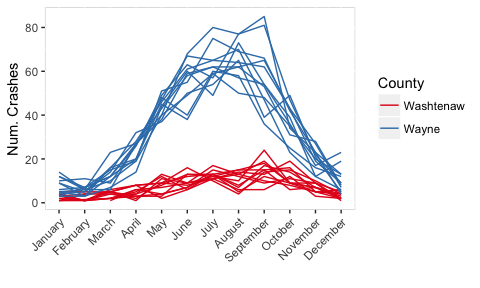

# Lab 4, October 3

[Solutions](lab4sol)

-   [Data transformation with `dplyr`](#data-transformation-with-dplyr)
    -   [`filter`](#filter)
    -   [`select`](#select)
    -   [`mutate`](#mutate)
    -   [`arrange`](#arrange)
    -   [`summarize`](#summarize)
    -   [`group_by`](#group_by)
-   [Exercise 1](#exercise-1)
-   [Exercise 2](#exercise-2)


## Data transformation with `dplyr`

Reference material: [Chapter 5](http://r4ds.had.co.nz/transform.html){:target="\_blank"}

There are five important `dplyr` functions or "verbs" for transforming a data frame. These functions can be chained together using the pipe operator `%>%`, and we use `group_by` to apply those functions within groups defined by one or more variables.

Let's review these functions with data on the 45 U.S. presidents. Download and import [`presidents.txt`](/data/presidents.txt){:target="\_blank"}:

``` r
p <- read.csv('presidents.txt', header=T)
```

### filter

Choose rows according to the values of one or more variables.

Which presidents were born in Ohio?

``` r
filter(p, birth_state == "Ohio")

# output omitted
```


### select

Choose columns by name or position.

Only display the names of the presidents born in Ohio:

``` r
filter(p, birth_state == "Ohio") %>%
  select(lastname, firstname)
```

    ##   lastname  firstname
    ## 1 Harrison    William
    ## 2    Grant    Ulysses
    ## 3    Hayes Rutherford
    ## 4 Garfield      James
    ## 5 Harrison   Benjamin
    ## 6 McKinley    William
    ## 7     Taft    William
    ## 8  Harding     Warren

### mutate

Create new variables.

Calculate the age of each president on inauguration day.

``` r
p %>% mutate(inaug_age = inaug_year - birth_year) %>%
  select(lastname, firstname, inaug_age) %>%
  head(7) # display the top 7 rows
```

    ##     lastname firstname inaug_age
    ## 1 Washington    George        57
    ## 2      Adams      John        62
    ## 3  Jefferson    Thomas        58
    ## 4    Madison     James        58
    ## 5     Monroe     James        59
    ## 6      Adams      John        58
    ## 7    Jackson    Andrew        62

### arrange

Reorder (sort) rows according to one or more variables.

Sort the presidents according to age on inauguration day:

``` r
p %>% mutate(inaug_age = inaug_year - birth_year) %>%
  select(lastname, firstname, inaug_age) %>%
  arrange(desc(inaug_age)) %>% # sort in descending order
  head(5) # display the top 5 rows
```

    ##   lastname firstname inaug_age
    ## 1    Trump    Donald        71
    ## 2   Reagan    Ronald        70
    ## 3 Harrison   William        68
    ## 4 Buchanan     James        66
    ## 5   Taylor   Zachary        65

### summarize

Collapse many rows into a single summary value.

How old was the youngest inaugurated president?

``` r
p %>% 
  mutate(inaug_age = inaug_year - birth_year) %>% 
  summarize(min_age = min(inaug_age))
```

    ##   min_age
    ## 1      43

### group_by

When combined with `group_by`, the above functions will be applied within each value of a grouping variable.

For each political party, which president was the youngest when inaugrated?

``` r
p %>% 
  mutate(inaug_age = inaug_year - birth_year) %>%
  group_by(party) %>%
  mutate(min_age = min(inaug_age)) %>%
  filter(inaug_age == min_age) %>%
  select(lastname, firstname, party, min_age, inaug_age)
```

    ## # A tibble: 10 x 4
    ## # Groups:   party [9]
    ##      lastname                                     party min_age inaug_age
    ##        <fctr>                                    <fctr>   <dbl>     <int>
    ##  1 Washington                               Independent      57        57
    ##  2      Adams                                Federalist      62        62
    ##  3  Jefferson                     Democratic-Republican      58        58
    ##  4    Madison                     Democratic-Republican      58        58
    ##  5      Adams Democratic-Republican/National Republican      58        58
    ##  6   Fillmore                                      Whig      50        50
    ##  7    Lincoln                 Republican/National Union      52        52
    ##  8    Johnson                 Democratic/National Union      57        57
    ##  9  Roosevelt                                Republican      43        43
    ## 10    Kennedy                                Democratic      44        44


## Exercise 1

First run the following code to create two `Date` columns for the inauguration date and last day in office.

``` r
p <-
  p %>% mutate(left_date = 
               as.Date(paste(left_year, sprintf("%02d", left_month), 
                             sprintf("%02d", left_day), sep='-'),
                       format='%Y-%m-%d'),
             inaug_date = 
               as.Date(paste(inaug_year, sprintf("%02d", inaug_month), 
                             sprintf("%02d", inaug_day), sep='-'),
                       format='%Y-%m-%d'))
```

Answer the following questions using the five `dplyr` functions discussed above.

1.  Which president had the shortest term in office? Create a new variable, `days_in_office` which contains the number of days each president was in office. Note that you can subtract `Date` objects to compute the length of time between two dates. Then use `arrange` to find the president with the shortest term.

2.  Display a list of presidents who were born or died on July 4 (in any year). Only display their full names, birth dates and dates of death.

3.  List the number of presidents in each political party, only counting presidents inaugurated after the end of the Civil War (May 9, 1865). Use `filter`, `group_by`, and `summarize`. 
    Hints:

    ``` r
    as.Date("2017-10-02") >= "2017-09-05"
    ```

        ## [1] TRUE

    ``` r
    as.Date("2017-10-02") >= "2017-11-05"
    ```

        ## [1] FALSE

    ``` r
    p %>% summarise(nrows = n())
    ```

        ##   nrows
        ## 1    45

## Exercise 2

For this exercise we will use data on cyclist-involved crashes in Michigan (from [MTCF](https://www.michigantrafficcrashfacts.org/){:target="\_blank"}). Download `cyclist_crashes.txt` from our Canvas site. Load the data into a data frame called `cr`. Each row in this data frame represents a single car-cyclist crash in Michigan.

Run the following code to import the data and create a variable corresponding to the hour when each crash occurred.

``` r
cr <- read.csv('cyclist_crashes.txt', header=T)
timelevels <- c("2:00 PM - 3:00 PM" = 14, 
  "      2:00 PM - 3:00 PM" = 14,
  "12:00 midnight - 1:00 AM" = 00,
  "1:00 AM - 2:00 AM" = 01,
  "2:00 AM - 3:00 AM" = 02,
  "3:00 AM - 4:00 AM" = 03,
  "4:00 AM - 5:00 AM" = 04,
  "5:00 AM - 6:00 AM" = 05,
  "6:00 AM - 7:00 AM" = 06,
  "7:00 AM - 8:00 AM" = 07,
  "8:00 AM - 9:00 AM" = 08,
  "9:00 AM - 10:00 AM" = 09,
  "12:00 noon - 1:00 PM" = 12,
  "1:00 PM - 2:00 PM" = 13,
  "10:00 AM - 11:00 AM" =10,
  "10:00 PM - 11:00 PM"    = 22 ,
  "11:00 AM - 12:00 noon" = 11,
  "3:00 PM - 4:00 PM" = 15,
  "4:00 PM - 5:00 PM" = 16,
  "5:00 PM - 6:00 PM" = 17,
  "6:00 PM - 7:00 PM" = 18,
  "7:00 PM - 8:00 PM" = 19,
  "8:00 PM - 9:00 PM" = 20,
  "9:00 PM - 10:00 PM" = 21,
  "11:00 PM - 12:00 midnight" = 23,
  "Unknown" = NA
)
cr <- mutate(cr, 
             hour_num = timelevels[paste(Time.of.Day)])
```

Familiarize yourself with the variables in this data set.

1.  Use `select` to make `cr` contain the following variables with the following names:

    |         id|date       | year|month     |hour_num    |day      |tod                 |County    |city                             |worst.injury                 |
    |----------:|:----------|----:|:---------|:----|:--------|:-------------------|:---------|:--------------------------------|:----------------------------|
    | 2004374322|2004-09-23 | 2004|September|19 |Thursday |7:00 PM - 8:00 PM   |Macomb    |Macomb County: Roseville         |Fatal                        |
    | 2004374216|2004-11-07 | 2004|November|10 |Sunday   |10:00 AM - 11:00 AM |Monroe    |Monroe County: Lasalle Twp.      |Fatal                        |
    | 2004373946|2004-10-19 | 2004|October| 15   |Tuesday  |3:00 PM - 4:00 PM   |Berrien   |Berrien County: Lincoln Twp.     |B - nonincapacitating injury |
    | 2004373597|2004-11-22 | 2004|November| 20   |Monday   |8:00 PM - 9:00 PM   |Oakland   |Oakland County: Hazel Park       |A - incapacitating injury    |
    | 2004371832|2004-12-16 | 2004|December| 16   |Thursday |4:00 PM - 5:00 PM   |Hillsdale |Hillsdale County: Hillsdale Twp. |B - nonincapacitating injury |
    | 2004371712|2004-12-28 | 2004|December| 4   |Tuesday  |4:00 AM - 5:00 AM   |Kent      |Kent County: Wyoming             |A - incapacitating injury    |
        
    Note: Give the name `id` to the variable `Crash.Instance`.

2.  How many cyclist-involved crashes were there in Washtenaw County in 2004? How many were there in Washtenaw County in August of 2015?

3.  Use `group_by` and `summarize` to compute the number of cyclist-involved crashes in each county in each year. Store the results in a new data frame called `cr_year`, and sort this data frame by year and then by county name. Your data frame `cr_year` should look like this:

    ```r
    head(cr_year)
    ```
    
    | County  |  year|  ncrash|
    |:--------|:----|---:|
    | Allegan |  2004|      18|
    | Alpena  |  2004|      12|
    | Antrim  |  2004|       2|
    | Baraga  |  2004|       1|
    | Barry   |  2004|       9|
    | Bay     |  2004|      31|

4.  For each year, display the three counties with the highest number of crashes. To do this, complete the following code:

    ``` r
    cr_year %>%
      group_by(...) %>%                 # for each year
      mutate(mrank = min_rank(...)) %>% # rank the counties by number of crashes
      filter(...)                       # display the top 3 counties
    ```

    What were the three counties with the highest number of cyclist-involved crashes in 2015? Are you surprised?

5. Use `mutate` to add a column called `month_num` to `cr` that contains the numeric month. Apply the function `strftime` to the `date` variable. You will need to convert the results of `strftime` to a number using `as.numeric`. 
    ``` r
    # fill in the arguments to strftime
    cr <- mutate(cr, month_num = as.numeric(strftime(...))) 
    ```

6. Filter `cr` to only contain crashes in Washtenaw and Wayne counties. Then compute the number of crashes in each of those two counties for each month-year combination. Plot the results as follows:
    
    
    
    Hints:
      - Use the `%in%` operator when filtering the data frame.
      - Use `group_by` followed by `summarize`
      - Map the `month_num` variable to the x-axis.
      - To control the x-axis labels you can use ths code:
      
         ``` r  
         # month.name is a built-in vector of month names
         + scale_x_continuous(breaks=1:12, labels=month.name) +
         theme(axis.text.x=element_text(hjust=1, angle=45))
	 ```

7. For each month, what proportion of crashes occurred during each hour of the day? Use `group_by`, `mutate` and `summarize` (possibly more than once) applied to the `month_num` and `hour_num` columns. Plot the proportion of crashes versus the hour of the day with a line for each month.