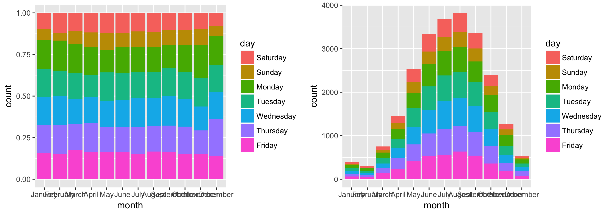
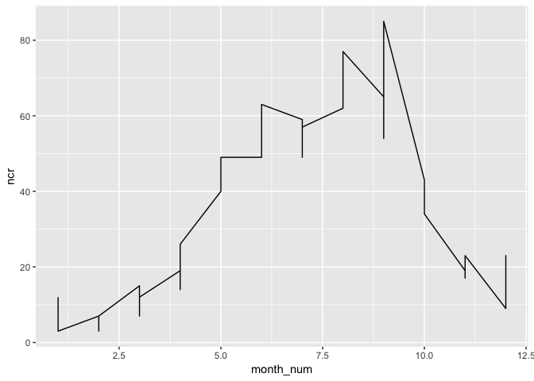
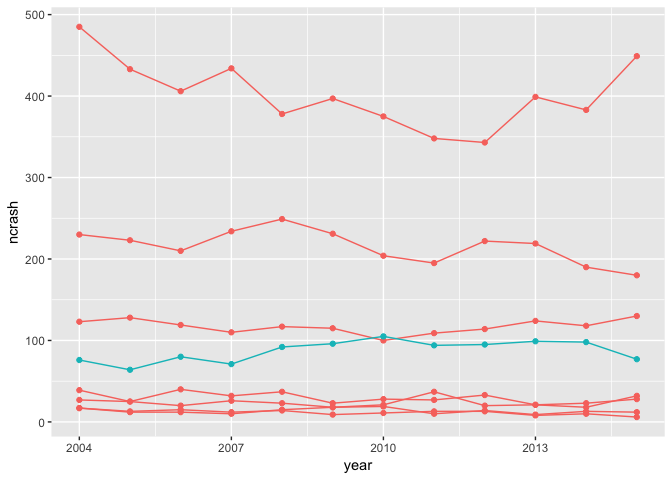
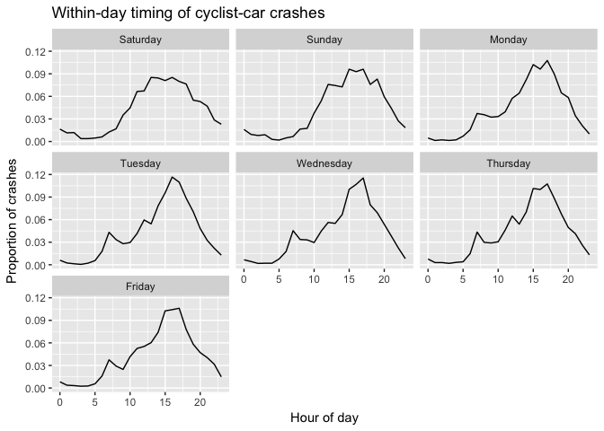

# Lab 5, October 10

-   [Exam review exercises](#exam-review-exercises)
-   [Extra exercise (using your computer)](#extra-exercise-using-your-computer)

To complete these exercises, first download `cyclist_crashes.txt` into your working directory (see [Lab 4](../lab4)). Then download and run the R script `import_crashes.R` (available [here](/import_crashes.R){:target="\_blank"}) which imports these data into a data frame called `cr` and restructures some of the variables.

The `source` command will run all the commands in a file.

``` r
source('import_crashes.R')
```

## Exam review exercises

**Complete these exercises without your computer!**

1.  The `day` variable is a factor (categorical) variable containing the day of the week when the cyclist crash occurred. `month` contains the month name.

    Consider the following graphs:

    
    (a) What `geom` is used in both graphs?  
    (b) What variables are mapped to the `x` and `y` aesthetics?  
    (c) Write the commands to create both graphs.  
    (d) How would a `ggplot` expert describe the difference between the two graphs (using R and `ggplot` jargon)?   
    (e) How would a regular person describe the difference between the two graphs (what do they communicate about cyclist-involved crashes)?  

1.  Write a command which creates a new data frame, called `cr_wayne`, which only contains crashes that occurred in Wayne county in 2013, 2014, and 2015 (the latest year in the data frame `cr`).

    Then consider this command:

    ``` r
    cr_wayne %>% 
      group_by(month_num, year) %>%
      summarize(ncr = n()) %>%
      ggplot(aes(x=month_num, y=ncr)) + 
      geom_line()
    ```
    
    What aesthetic should be altered to fix the plot? Write the correct `ggplot` command so that the number of crashes in each month is plotted seperately for each year.

1.  Consider the following command.

    ``` r
    filter(cr, County=="Washtenaw") %>%                                 # line 1
      group_by(year, month) %>%                                         #      2
      summarise(ncr = n()) %>%                                          #      3
      group_by(year) %>%                                                #      4
      mutate(rank_ncr = min_rank(desc(ncr))) %>% filter(rank_ncr <= 2) %>% #   5
      select(-rank_ncr) %>%                                             #      6
      arrange(desc(year))                                               #      7
    ```

    (a) Describe, in words, what is acocmplished by lines 1--3. Write down two (possible) rows of the data frame that results from running only lines 1--3 (with the final `%>%` operator removed).  
    (b) To describe lines 4 and 5, complete these sentences:  
            "For each ____, rank the ____s by the number of ____s that occurred. Then keep the two ____s with the (highest/lowest) number of ____s."  
    (c) Now describe what the entire command accomplishes. Write down possible values for the first three rows of the result.  
    (d) How many rows does the resulting data frame contain? Assume that there were cyclist-car crashes in all years and months in Washtenaw county. There are 12 years represented in this data set.

1.  Recall the data frame `cr_year`, which contains the number of cyclist-car crashes in each year and County:

    ``` r
    head(cr_year)
    ```

        ## # A tibble: 6 x 3
        ## # Groups:   County [6]
        ##    County  year ncrash
        ##    <fctr> <int>  <int>
        ## 1 Allegan  2004     18
        ## 2  Alpena  2004     12
        ## 3  Antrim  2004      2
        ## 4  Baraga  2004      1
        ## 5   Barry  2004      9
        ## 6     Bay  2004     31
    
    Suppose I create a list of the counties that surround Washtenaw county, like this:

    ``` r
    county_list <-  c('Wayne','Washtenaw',
                      "Livingston","Jackson","Ingham",
                      "Oakland","Lenawee","Monroe")
    ```

    Fill in the following code to create the graph below. The blue line and points plot the number of crashes for Washtenaw county. (The legend is hidden.)

    ``` r
    ggplot(filter(cr_year, ...), #fill in the arguments to filter
           aes(...)) + #fill in the arguments to aes()
           ... # two geoms are required
    ```

    

## Extra exercise (using your computer)

Continuing with the crash data, recreate the following plot:



Map the `x` aesthetic to the `hour_num` variable. You will need to compute the `y` variable using `group_by`, `summarise` and `mutate`. This displays the proportion of crashes, in each day of the week, that occur during each hour of the day (all years and counties are pooled). 
