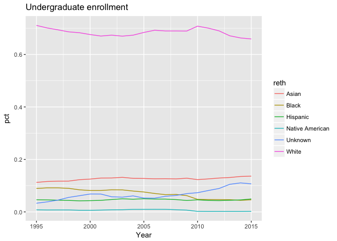
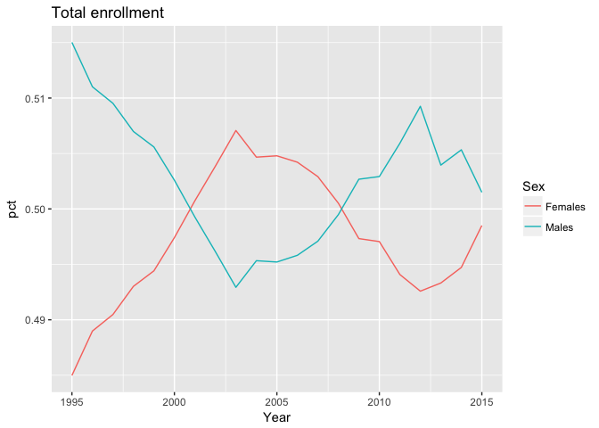

# Lab 7, October 31

-   [Tidy data](#tidy-data)
-   [Exercise: University of Michigan Enrollment](#exercise-university-of-michigan-enrollment)
    -   [Part 1](#part-1)
    -   [Part 2](#part-2)


## Tidy data

Reference: [R4DS Chapter 12](http://r4ds.had.co.nz/tidy-data.html){:target="_blank"}

Data are "tidy" if each row is an observation and each column is a variable.

Here's an example using population counts for Michigan counties in the past five years. The data are available on [Canvas](https://umich.instructure.com/courses/181629/files){:target="_blank"}.

``` r
head(cpop <- read_csv('county-pop-2016.csv'))
```

    ## # A tibble: 6 x 8
    ##    County respop72010 respop72011 respop72012 respop72013 respop72014
    ##     <chr>       <int>       <int>       <int>       <int>       <int>
    ## 1  Alcona       10890       10776       10609       10573       10439
    ## 2   Alger        9565        9550        9495        9495        9424
    ## 3 Allegan      111502      111550      111929      112415      113778
    ## 4  Alpena       29539       29339       29208       29012       28932
    ## 5  Antrim       23499       23385       23336       23219       23244
    ## 6  Arenac       15853       15617       15495       15412       15324
    ## # ... with 2 more variables: respop72015 <int>, respop72016 <int>

This datset is not tidy because the columns are not variables---the population in each year is spread across multiple columns. The column names actually contain values of the variable `year`.

Imagine trying to plot the population of Washtenaw county over time using `ggplot`:

``` r
filter(cpop, County=='Washtenaw')
```

    ## # A tibble: 1 x 8
    ##      County respop72010 respop72011 respop72012 respop72013 respop72014
    ##       <chr>       <int>       <int>       <int>       <int>       <int>
    ## 1 Washtenaw      345568      349071      351299      354573      358980
    ## # ... with 2 more variables: respop72015 <int>, respop72016 <int>

You would not be able to display the year on the x-axis. We need a variable for the year and a variable for the population count.

The `gather` function will move the column names into a `year` variable and store the population counts in a single column.

`gather` requires these three parameters:

-   The columns that contain values, not variables (the `respop####` columns).
-   The name of the column whose values are the column names from the previous step (`year` in this case).
-   The name of the variable whose values are spread across the columns (`count`, for population counts)

Putting this together,

``` r
(cpop <- 
  cpop %>%
  gather(contains('respop'),
         key = 'year', value = 'count'))
```

    ## # A tibble: 581 x 3
    ##     County        year  count
    ##      <chr>       <chr>  <int>
    ##  1  Alcona respop72010  10890
    ##  2   Alger respop72010   9565
    ##  3 Allegan respop72010 111502
    ##  4  Alpena respop72010  29539
    ##  5  Antrim respop72010  23499
    ##  6  Arenac respop72010  15853
    ##  7  Baraga respop72010   8842
    ##  8   Barry respop72010  59081
    ##  9     Bay respop72010 107688
    ## 10  Benzie respop72010  17512
    ## # ... with 571 more rows

The `contains()` function selects all columns whose names contain the specified string. The resulting `year` column is of `character` type. The final step would be to extract the numeric year from the strings `respop72010`, `respop72011`, etc. (Below I use the `str_replace` function from the `stringr` package.)

``` r
library(stringr)
cpop <- 
  mutate(cpop, year = as.numeric(str_replace(year, fixed('respop7'), '')))
```

Now we could plot population counts over time, for example:

``` r
filter(cpop, County=='Washtenaw')
```

    ## # A tibble: 7 x 3
    ##      County  year  count
    ##       <chr> <dbl>  <int>
    ## 1 Washtenaw  2010 345568
    ## 2 Washtenaw  2011 349071
    ## 3 Washtenaw  2012 351299
    ## 4 Washtenaw  2013 354573
    ## 5 Washtenaw  2014 358980
    ## 6 Washtenaw  2015 360847
    ## 7 Washtenaw  2016 364709

The `spread` function does the opposite of `gather`:

``` r
spread(cpop, key='year', value = 'count')
```

    ## # A tibble: 83 x 8
    ##     County `2010` `2011` `2012` `2013` `2014` `2015` `2016`
    ##  *   <chr>  <int>  <int>  <int>  <int>  <int>  <int>  <int>
    ##  1  Alcona  10890  10776  10609  10573  10439  10333  10352
    ##  2   Alger   9565   9550   9495   9495   9424   9347   9219
    ##  3 Allegan 111502 111550 111929 112415 113778 114661 115548
    ##  4  Alpena  29539  29339  29208  29012  28932  28791  28704
    ##  5  Antrim  23499  23385  23336  23219  23244  23133  23144
    ##  6  Arenac  15853  15617  15495  15412  15324  15280  15122
    ##  7  Baraga   8842   8818   8708   8682   8623   8546   8503
    ##  8   Barry  59081  58970  59068  59134  59283  59393  59702
    ##  9     Bay 107688 107498 107091 106910 106232 105557 104747
    ## 10  Benzie  17512  17431  17389  17400  17511  17436  17572
    ## # ... with 73 more rows


## Exercise: University of Michigan Enrollment

Using data from the [Registrar](http://ro.umich.edu/enrollment/ethnicity.php){:target="_blank"}, I created two files containing University of Michigan enrollment counts by race/ethnicity and sex. Download these files from our [Canvas page](https://umich.instructure.com/courses/181629/files){:target="_blank"}.

The first file has enrollment counts for the years 2006--2015 and the second has the counts for 1995--2005. First import the files:

``` r
d15 <- read_csv('umich_enrollment15.csv')
d05 <- read_csv('umich_enrollment05.csv')
```

### Part 1

1.  Familiarize yourself with how these data are formatted. Are the datasets "tidy"? I suggest running these commands:

    ``` r
    names(d15)
    names(d05)
    head(d15)
    head(d05)
    count(d15, Level, Sex)
    ```

2.  The older data (`d05`) has fewer race/ethnicity categories. Use `mutate` to redefine the `Unknown` column in `d15` so that it combines the "Two or More", "Hawaiian" and "Unknown" categories. Remove the columns for "Two or More" and "Hawaiian".

3.  The two data frames `d05` and `d15` should now have the same variables (columns). Run this command to "stack" the two datasets on top of each other:

    ``` r
    d <- bind_rows(d15, d05)
    ```

1.  Create a data frame called `d_ut` with the undergraduate enrollment counts for men and women combined (filter the `Level` and `Sex` columns).

2.  Compute the proportion of undergraduates in each race/ethnicity category. We can do this using `mutate_at`, which applies the same transformation to multiple columns. Run this command to complete this step:

    ``` r
    d_ut <-
      mutate_at(d_ut, vars(-Level, -Sex, -Year, -All), funs(. / All))
    ```

    This command selects all columns except `Level`, `Sex`, `Year` and `All`, and then divides each column by the value in `All`.
    You should now have a dataset like this:

    ``` r
    head(d_ut)
    ```

        ## # A tibble: 6 x 10
        ##           Level   Sex  Year   All     Asian      Black   Hispanic
        ##           <chr> <chr> <int> <int>     <dbl>      <dbl>      <dbl>
        ## 1 Undergraduate Total  2015 26353 0.1364171 0.04614275 0.04933025
        ## 2 Undergraduate Total  2014 26442 0.1350125 0.04409651 0.04572271
        ## 3 Undergraduate Total  2013 26329 0.1311482 0.04656462 0.04420981
        ## 4 Undergraduate Total  2012 26175 0.1290926 0.04691500 0.04305635
        ## 5 Undergraduate Total  2011 25752 0.1257766 0.04706431 0.04360826
        ## 6 Undergraduate Total  2010 25383 0.1231139 0.04782729 0.04597565
        ## # ... with 3 more variables: `Native American` <dbl>, White <dbl>,
        ## #   Unknown <dbl>

    Each column contains the percent undergraduate enrollment in one of the race/ethnicity categories.

3.  Use `gather` so that `d_ut` has a column called `reth`, containing the race/ethnicity category, and a column called `pct`, containing the percent enrollment in that category. Then create the following plot.
    
    

### Part 2

1.  Now let's focus on total enrollment by gender. Filter the `Level` variable to create a data frame called `d_t` containing just the total counts (remove the rows with undergraduate enrollment counts). Use `select` so that `d_t` only has three columns: `Sex`, `Year`, and `All` (the enrollment count across all race/ethnicity categories).

2.  Compute the percent enrollment for each gender in each year. First use `spread` so we have separate columns for the male and female enrollment counts:

        ## # A tibble: 21 x 4
        ##     Year Females Males Total
        ##  * <int>   <int> <int> <int>
        ##  1  1995   15854 16836 32690
        ##  2  1996   15824 16537 32361
        ##  3  1997   16065 16689 32754
        ##  4  1998   16093 16549 32642
        ##  5  1999   16286 16654 32940
        ##  6  2000   16334 16504 32838
        ##  7  2001   16627 16578 33205
        ##  8  2002   16849 16591 33440
        ##  9  2003   16995 16521 33516
        ## 10  2004   17126 16809 33935
        ## # ... with 11 more rows

    Then `mutate` the `Females` and `Males` columns so they contain proportions instead of counts.

3.  Now `gather` the result so there is a `Sex` column and a `pct` column.

        ## # A tibble: 42 x 4
        ##     Year Total     Sex       pct
        ##    <int> <int>   <chr>     <dbl>
        ##  1  1995 32690 Females 0.4849801
        ##  2  1996 32361 Females 0.4889837
        ##  3  1997 32754 Females 0.4904744
        ##  4  1998 32642 Females 0.4930151
        ##  5  1999 32940 Females 0.4944141
        ##  6  2000 32838 Females 0.4974115
        ##  7  2001 33205 Females 0.5007378
        ##  8  2002 33440 Females 0.5038577
        ##  9  2003 33516 Females 0.5070712
        ## 10  2004 33935 Females 0.5046707
        ## # ... with 32 more rows

4.  Finally, create this plot of the proportion of men and women at Michigan over time:  
    
    