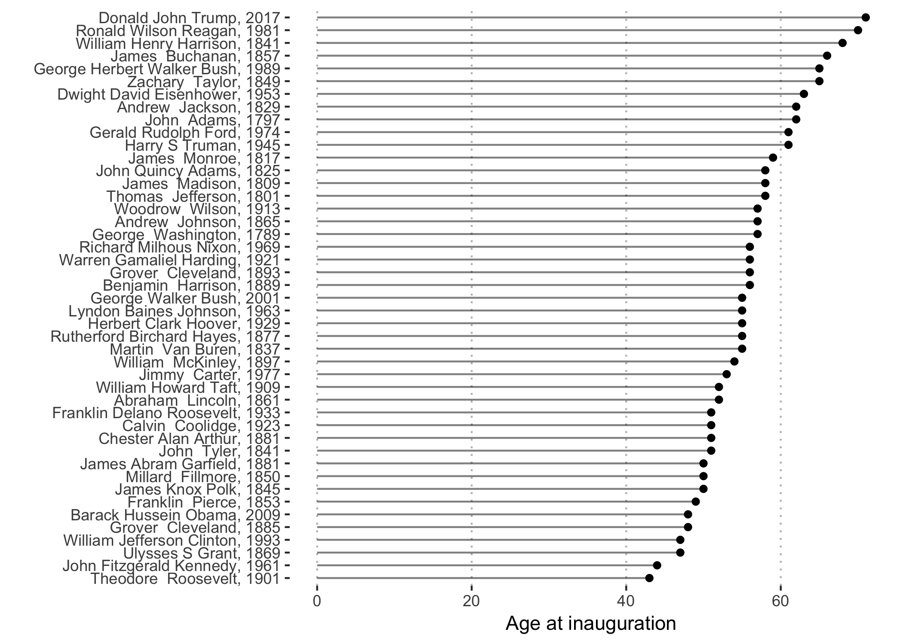
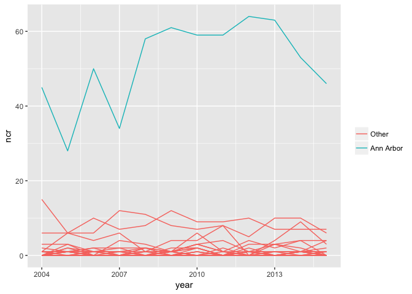

# Lab 8, November 7

-   [Separating and uniting](#separating-and-uniting)
    -   [`unite`](#unite)
    -   [`separate`](#separate)
-   [Exercise: Cyclist crashes in MI (again)](#exercise-cyclist-crashes-in-mi-again)

## Separating and uniting

In Lab 4 we learned about `dplyr` functions using data on the 45 U.S. presidents.

For this example, we'll look at a messier version of the same dataset. The file `presidents_messy.txt` is on [Canvas](https://umich.instructure.com/courses/181629/files){:target="_blank"}.

``` r
pres <- read_csv('presidents_messy.txt')
print(pres)
```

    ## # A tibble: 45 x 15
    ##       ID `Last Name` `First Name` `Middle Name` `Order of Presidency`
    ##    <int>       <chr>        <chr>         <chr>                 <int>
    ##  1     1  Washington       George          <NA>                     1
    ##  2     2       Adams         John          <NA>                     2
    ##  3     3   Jefferson       Thomas          <NA>                     3
    ##  4     4     Madison        James          <NA>                     4
    ##  5     5      Monroe        James          <NA>                     5
    ##  6     6       Adams         John        Quincy                     6
    ##  7     7     Jackson       Andrew          <NA>                     7
    ##  8     8   Van Buren       Martin          <NA>                     8
    ##  9     9    Harrison      William         Henry                     9
    ## 10    10       Tyler         John          <NA>                    10
    ## # ... with 35 more rows, and 10 more variables: `Date of Birth` <chr>,
    ## #   `Date of Death` <chr>, `Town or County of Birth` <chr>, `State of
    ## #   Birth` <chr>, `Home State` <chr>, `Party Affiliation` <chr>, `Date
    ## #   Took Office` <chr>, `Date Left Office` <chr>, `Assassination
    ## #   Attempt` <lgl>, Assassinated <lgl>

### `unite`

`unite` combines multiple columns into a single column. Suppose we want a single column containing the president's full name:

``` r
pres %>%
  unite(name,         # first argument is the name of the new column to create
        `First Name`, # subsequent arguments specify the columns to unite
        `Middle Name`,
        `Last Name`,
        sep=' ' # the character that will separate the values of the united columns
        ) %>%
  select(name)
```

    ## # A tibble: 45 x 1
    ##                      name
    ##  *                  <chr>
    ##  1   George NA Washington
    ##  2          John NA Adams
    ##  3    Thomas NA Jefferson
    ##  4       James NA Madison
    ##  5        James NA Monroe
    ##  6      John Quincy Adams
    ##  7      Andrew NA Jackson
    ##  8    Martin NA Van Buren
    ##  9 William Henry Harrison
    ## 10          John NA Tyler
    ## # ... with 35 more rows

Some presidents do not have a middle name listed in this dataset. We should replace the `NA` values:

``` r
pres <-
  pres %>%
  mutate(`Middle Name` = ifelse(is.na(`Middle Name`), '', `Middle Name`)) %>%
  unite(name, `First Name`,  `Middle Name`,    `Last Name`, sep=' ') 
```

By default, the united columns and dropped from the data frame.

``` r
print(pres)
```

    ## # A tibble: 45 x 13
    ##       ID                   name `Order of Presidency` `Date of Birth`
    ##  * <int>                  <chr>                 <int>           <chr>
    ##  1     1     George  Washington                     1      02/22/1732
    ##  2     2            John  Adams                     2      10/30/1735
    ##  3     3      Thomas  Jefferson                     3      04/13/1743
    ##  4     4         James  Madison                     4      03/16/1751
    ##  5     5          James  Monroe                     5      04/28/1758
    ##  6     6      John Quincy Adams                     6      07/11/1767
    ##  7     7        Andrew  Jackson                     7      03/15/1767
    ##  8     8      Martin  Van Buren                     8      12/05/1782
    ##  9     9 William Henry Harrison                     9      02/09/1773
    ## 10    10            John  Tyler                    10      03/29/1790
    ## # ... with 35 more rows, and 9 more variables: `Date of Death` <chr>,
    ## #   `Town or County of Birth` <chr>, `State of Birth` <chr>, `Home
    ## #   State` <chr>, `Party Affiliation` <chr>, `Date Took Office` <chr>,
    ## #   `Date Left Office` <chr>, `Assassination Attempt` <lgl>,
    ## #   Assassinated <lgl>

### `separate`

`separate` separates a single column into multiple columns.
The `Date of Birth` column is currently stored as a character vector. We can use `separate` to extract the month, day, and year of birth.

```r
pres <-
  pres %>%
  separate(`Date of Birth`,        # the column to separate
           c('birth_month', 'birth_day', 'birth_year'),  # the names of the new columns
           sep = '/',        # the character defining the separation
           remove = FALSE,   # should the original column be removed from the result?
           convert = TRUE)   # convert the new columns to numeric variables if possible

## Check the results
pres %>% select(contains("birth"))
```

    ## # A tibble: 45 x 6
    ##    `Date of Birth` birth_month birth_day birth_year
    ##  *           <chr>       <int>     <int>      <int>
    ##  1      02/22/1732           2        22       1732
    ##  2      10/30/1735          10        30       1735
    ##  3      04/13/1743           4        13       1743
    ##  4      03/16/1751           3        16       1751
    ##  5      04/28/1758           4        28       1758
    ##  6      07/11/1767           7        11       1767
    ##  7      03/15/1767           3        15       1767
    ##  8      12/05/1782          12         5       1782
    ##  9      02/09/1773           2         9       1773
    ## 10      03/29/1790           3        29       1790
    ## # ... with 35 more rows, and 2 more variables: `Town or County of
    ## #   Birth` <chr>, `State of Birth` <chr>

Let's do the same thing for each president's inauguration date. By default, any non-alphanumeric character, such as `/`, will be used as the delimiting character. So we can omit the `sep=` argument in this case.

```r
pres <-
  separate(pres, `Date Took Office`, into=c('inag_month', 'inaug_day', 'inaug_year'),
           convert = TRUE)
```

```r
pres %>% mutate(inaug_age = inaug_year - birth_year) %>%
  select(name, inaug_age, inaug_year) %>%
  unite(nameyear, name, inaug_year, sep=', ') %>%
  arrange(inaug_age) %>%
  mutate(nameyear = factor(nameyear, levels = nameyear)) %>% 
  ggplot(aes(x=inaug_age, y=nameyear)) + 
  geom_point() + 
  geom_segment(aes(x=0, xend=inaug_age, y=nameyear, yend=nameyear),
               linetype='dashed') + 
  theme(panel.background=element_rect(fill=NA))
```



## Exercise: Cyclist crashes in MI (again)

To illustrate `unite`, `separate`, and techniques for handling missing values (see [section 12.5](http://r4ds.had.co.nz/tidy-data.html#missing-values-3){:target="_blank"}), we will analyze (yet again) data on motorist-cyclist crashes in Michigan (the data are on Canvas).

``` r
cr <- read_csv("cyclist_crashes.txt") %>% 
  rename(city = City.or.Township) # for convenience
```

Recall that this dataset contains one row for each bicycle-involved crash in Michigan between 2004 and 2015.

1.  Compute the number of crashes in each `County`-`year` combination. Store the result in a data frame called `cr_year`, which should look like this:

    ``` r
    print(cr_year)
    ```

        ## # A tibble: 857 x 3
        ## # Groups:   County [?]
        ##     County  year   ncr
        ##      <chr> <int> <int>
        ##  1  Alcona  2006     1
        ##  2  Alcona  2009     1
        ##  3   Alger  2008     2
        ##  4   Alger  2009     1
        ##  5   Alger  2012     1
        ##  6 Allegan  2004    18
        ##  7 Allegan  2005     9
        ##  8 Allegan  2006    14
        ##  9 Allegan  2007    10
        ## 10 Allegan  2008    11
        ## # ... with 847 more rows

1.  The dataset `cr_year` illustrates "implicit" missing values. For example:

    ``` r
    filter(cr_year, County=="Alcona")
    ```

        ## # A tibble: 2 x 3
        ## # Groups:   County [1]
        ##   County  year   ncr
        ##    <chr> <int> <int>
        ## 1 Alcona  2006     1
        ## 2 Alcona  2009     1

    This means that between 2004 and 2015 only two crashes were recorded in Alcona county, and they occurred during 2006 and 2009.
    To fill in the missing values, use the `complete` function. First read the documentation for `complete` [here](http://tidyr.tidyverse.org/reference/complete.html){:target="_blank"}. Then use `complete` so that `cr_year` has a row for every year-county combination and `ncr` is zero when there were no crashes in the corresponding county-year period. Fill in the following command:

    ``` r
    cr_year <-
        cr_year %>% 
          ungroup %>%   # for complete() to work properly we need to remove the grouping specification
          complete(...  # fill in the arguments to complete()

    print(cr_year)	  
    ```
    
        ## # A tibble: 996 x 3
        ##    County  year   ncr
        ##     <chr> <int> <dbl>
        ##  1 Alcona  2004     0
        ##  2 Alcona  2005     0
        ##  3 Alcona  2006     1
        ##  4 Alcona  2007     0
        ##  5 Alcona  2008     0
        ##  6 Alcona  2009     1
        ##  7 Alcona  2010     0
        ##  8 Alcona  2011     0
        ##  9 Alcona  2012     0
        ## 10 Alcona  2013     0
        ## # ... with 986 more rows

2.  As a review, use `spread` to produce the following table:

        ## # A tibble: 12 x 84
        ##     year Alcona Alger Allegan Alpena Antrim Arenac Baraga Barry   Bay
        ##  * <int>  <dbl> <dbl>   <dbl>  <dbl>  <dbl>  <dbl>  <dbl> <dbl> <dbl>
        ##  1  2004      0     0      18     12      2      0      1     9    31
        ##  2  2005      0     0       9     12      0      1      0     5    28
        ##  3  2006      1     0      14      8      2      1      0     4    37
        ##  4  2007      0     0      10     10      4      2      1     3    28
        ##  5  2008      0     2      11      8      1      1      0     4    31
        ##  6  2009      1     1       8      3      2      0      1     5    31
        ##  7  2010      0     0      19      7      1      2      0     7    24
        ##  8  2011      0     0      16      8      1      0      1     5    28
        ##  9  2012      0     1      15      7      3      1      0     6    26
        ## 10  2013      0     0      10     10      1      2      0     4    18
        ## 11  2014      0     0      11      8      2      1      0     1    37
        ## 12  2015      0     0      12      7      2      0      0     5    21
        ## # ... with 74 more variables: Benzie <dbl>, Berrien <dbl>, Branch <dbl>,
        ## #   Calhoun <dbl>, Cass <dbl>, Charlevoix <dbl>, Cheboygan <dbl>,
        ## #   Chippewa <dbl>, Clare <dbl>, Clinton <dbl>, Crawford <dbl>,
        ## #   Delta <dbl>, Dickinson <dbl>, Eaton <dbl>, Emmet <dbl>, Genesee <dbl>,
        ## #   Gladwin <dbl>, Gogebic <dbl>, `Grand Traverse` <dbl>, Gratiot <dbl>,
        ## #   Hillsdale <dbl>, Houghton <dbl>, Huron <dbl>, Ingham <dbl>,
        ## #   Ionia <dbl>, Iosco <dbl>, Iron <dbl>, Isabella <dbl>, Jackson <dbl>,
        ## #   Kalamazoo <dbl>, Kalkaska <dbl>, Kent <dbl>, Keweenaw <dbl>,
        ## #   Lake <dbl>, Lapeer <dbl>, Leelanau <dbl>, Lenawee <dbl>,
        ## #   Livingston <dbl>, Luce <dbl>, Mackinac <dbl>, Macomb <dbl>,
        ## #   Manistee <dbl>, Marquette <dbl>, Mason <dbl>, Mecosta <dbl>,
        ## #   Menominee <dbl>, Midland <dbl>, Missaukee <dbl>, Monroe <dbl>,
        ## #   Montcalm <dbl>, Montmorency <dbl>, Muskegon <dbl>, Newaygo <dbl>,
        ## #   Oakland <dbl>, Oceana <dbl>, Ogemaw <dbl>, Ontonagon <dbl>,
        ## #   Osceola <dbl>, Oscoda <dbl>, Otsego <dbl>, Ottawa <dbl>, `Presque
        ## #   Isle` <dbl>, Roscommon <dbl>, Saginaw <dbl>, Sanilac <dbl>,
        ## #   Schoolcraft <dbl>, Shiawassee <dbl>, `St. Clair` <dbl>, `St.
        ## #   Joseph` <dbl>, Tuscola <dbl>, `Van Buren` <dbl>, Washtenaw <dbl>,
        ## #   Wayne <dbl>, Wexford <dbl>

3.  How is the `city` variable formatted? Run this command:

    ``` r
    cr %>%
      select(year, Crash.Instance, city)
    ```

    Now use `separate` so that the `city` variable no longer contains the county name.
    Complete this command:

    ``` r
    cr <-
      cr %>% separate(col = ,     # fill in this argument
                      into =  c('city', 'county2'),
                      sep =      # fill in this argument
      )
    ```

    To check your answer:

    ``` r
    cr %>% select(Crash.Instance, city, County, county2)
    ```

        ## # A tibble: 23,809 x 4
        ##    Crash.Instance           city    County          county2
        ##  *          <int>          <chr>     <chr>            <chr>
        ##  1     2004374322      Roseville    Macomb    Macomb County
        ##  2     2004374216   Lasalle Twp.    Monroe    Monroe County
        ##  3     2004373946   Lincoln Twp.   Berrien   Berrien County
        ##  4     2004373597     Hazel Park   Oakland   Oakland County
        ##  5     2004371832 Hillsdale Twp. Hillsdale Hillsdale County
        ##  6     2004371712        Wyoming      Kent      Kent County
        ##  7     2004371686        Pontiac   Oakland   Oakland County
        ##  8     2004370977      Hillsdale Hillsdale Hillsdale County
        ##  9     2004370939        Detroit     Wayne     Wayne County
        ## 10     2004369253   Cascade Twp.      Kent      Kent County
        ## # ... with 23,799 more rows

4.  Create a data frame called `cr_year_wash` which contains the number of crashes in each city in Washtenaw county for the years 2004--2015.

    Your result should look like this:

    ``` r
    cr_year_wash
    ```

        ## # A tibble: 153 x 3
        ## # Groups:   city [?]
        ##         city  year   ncr
        ##        <chr> <int> <int>
        ##  1 Ann Arbor  2004    45
        ##  2 Ann Arbor  2005    28
        ##  3 Ann Arbor  2006    50
        ##  4 Ann Arbor  2007    34
        ##  5 Ann Arbor  2008    58
        ##  6 Ann Arbor  2009    61
        ##  7 Ann Arbor  2010    59
        ##  8 Ann Arbor  2011    59
        ##  9 Ann Arbor  2012    64
        ## 10 Ann Arbor  2013    63
        ## # ... with 143 more rows

5.  Are there any missing values in `cr_year_wash`? Ensure that there are no explicit or implicit missing values. If there were no crashes in a given year for any of the cities in Washtenaw county, make sure that `ncr` is zero for that year. If you call `complete` you should first call `ungroup` so there is no grouping variable in `cr_year_wash`.

6.  Create a plot of the number of crashes over time for the cities in Washtenaw county. Your plot should look something like this:

    

